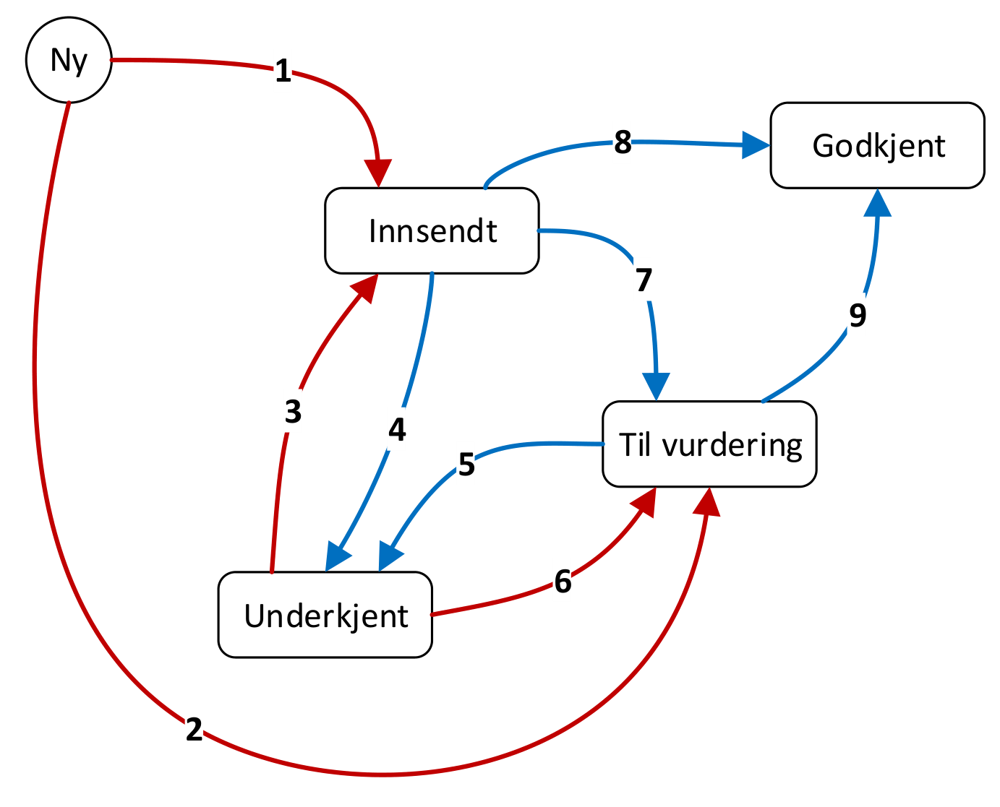

# Standard for kommunikasjon av oppgjørsdata med Pasientreiser


| Forfatter       | Dato       | Versjon |
| --------------- | ---------- | ------- |
| Nicolai Dybdahl | 20.01.2025 | 1.5.5   |

## Innledning

### Formål

Dette dokumentet beskriver standarden for digital kommunikasjon av oppgjørsdata mellom transportører og Pasientreiser.

Denne standarden bygger på SUTI-standarden. Iht. SUTI sin terminologi så beskriver dette dokumentet Pasientreisers selvdeklarasjon av SUTI-standarden for den delen som omhandler oppgjør. SUTI er en nordisk, ideell organisasjon som jobber for å utvikle og opprettholde en standard for kommunikasjon av trafikkinformasjon mellom datasystemer.

Dokumentasjon av standarden er i hovedsak delt i 3 kapitler. Først beskrives prosessen for oppgjørskontroll for enkeltturer i kapittel Oppgjorsprosess. Deretter beskrives meldingene, og hvordan enkeltturer grupperes sammen i kapittel Meldingsflyt. Til slutt beskrives meldingsinnholdet og syntaksen i detalj i kapittel Meldingsinnhold.

### Scope

Dette dokumentet beskriver prosess, meldingsflyt og innhold for kommunikasjon av oppgjørsdata mellom transportør og Pasientreiser.

Det beskriver ikke avtaler, prismodeller, eller regler for fakturering. Det beskriver heller ikke frekvens for oversendelse av oppgjør fra transportør. Disse tingene må avtalepartene håndtere selv.

Dokumentet beskriver ikke kommunikasjonsprotokoll, eller hvordan man foretar oppkobling, test og godkjenning. Se eget dokument for en beskrivelse av mulige oppkoblingsmuligheter mot Pasientreisers datasystemer.

### Siste versjon

Siste versjon av dette dokumentet, med tilhørende dokumentasjon, publiseres på [www.github.com/pasientreiser](http://www.github.com/pasientreiser)

### Versjonering

Presiseringer i dokumentasjonen vil gjennomføres uten at det innføres nye versjoner av selvdeklarasjonen.

Hvis det innføres en endring av selvdeklarasjonen vil versjonsnummeret endres. Versjonen er spesifisert i dette dokumentet, og i meldingsdefinisjonene.

## Referanser

#### SUTI-Standard 2016

Pasientreiser selvdeklarasjon er basert på flyt som er beskrevet i `SUTI Use Cases Basic Accounting` og som er en del av SUTI-standarden `SUTI 2016`.

#### Kommunikasjonsprotokoll for oppgjørskommunikasjon

Dette dokumentet beskriver detaljer om hvordan oppkobling skjer mellom transportørsystemene og Pasientreisers datasystemer. Dokumentet er fortsatt under utarbeidelse.

#### Meldingsdefinisjoner

Det finnes XML Skjema definisjoner (XSD) som underlag til dette dokumentet som beskriver/definerer meldingsinnhold i teknisk detalj.

## Oppgjørsprosess

Oppgjørsprosessen beskrives her for enkeltturer.

Transportøren initierer alltid oppgjørsprosessen ved å sende informasjon om turer det søkes betalt for. Pasientreiser vil sende et svar på denne turen med en av følgende statuser.

#### Godkjent (accepted)

Turen godkjennes av Pasientreiser, med den informasjon som ble innsendt. Den vil senere inngå i en faktura og utbetales.

#### Underkjent (rejected)

Turen underkjennes av Pasientreiser. Årsaken til at turen er underkjent skal fremgå av feilkoden(e) i svarmeldingen. Pasientreiser gjør ingenting videre med underkjente turer. Transportøren må selv velge hvordan underkjente turer skal håndteres videre. Hvis transportøren ønsker å få behandlet en underkjent tur finnes det to metoder. Turen kan sendes inn på nytt med endringer for deretter å bli behandlet på vanlig måte på nytt. Eller, hvis transportøren mener turen er feilaktig avvist, så kan den sendes på nytt til vurdering.

#### Vurderes (validate)

Turen sendes til vurdering av Pasientreiser. Vurderingsprosessen vil føre til en godkjennelse eller underkjennelse av turen på et senere tidspunkt.

Alternativt så kan transportør sende turen direkte til vurdering ved første gangs innsendelse, hvis det er forhold ved turen som tilsier at den må behandles manuelt.

### Tilstandsdiagram

Tilstandsdiagrammet i figuren under viser hvilke statuser turer kan ha, og hvordan turer kan havne i disse statusene. Røde transisjoner (1,2,3,6,11,12) utføres av transportør. Blå transisjoner (4,5,7,8,9,10) utføres av Pasientreiser.



### Fakturering

Pasientreiser initierer faktureringsprosessen. Pasientreiser sender en melding til transportøren når en godkjent tur skal inngå i en faktura eller utbetales, iht. reglene for fakturering som er avtalt mellom partene.

## Meldingsflyt

Meldingsflyten definerer hvordan turer som inngår i oppgjørsprosessen skal sendes i oppgjørsmeldinger. De forskjellige meldingene er identifisert av en 4-sifret SUTI-kode.

Flere turer bør samles og sendes i samme oppgjørsmelding.

Meldinger som sendes til Pasientreiser som ikke inngår i meldingene beskrevet nedenfor, eller meldinger som sendes til Pasientreiser som transportøren ikke har mulighet til å sende iht. dokumentasjonen, vil bli ignorert av mottakende system.

### Innsendelse av oppgjørsmelding fra transportør

Dette er meldinger som brukes for innsendelse av oppgjør til Pasientreiser. Disse meldingene kalles samlet for oppgjørsmeldinger.

Alle turer som sendes inn i samme oppgjørsmelding skal være kjørt på samme avtale for samme kontor, og skal faktureres på samme måte.

#### 8000

Transportøren vil som oftest initiere oppgjørsprosessen ved å sende en 8000-melding til Pasientreiser.

Turer som inngår i transisjon 1 eller 3 i figur tilstandsdiagram skal inngå i 8000-meldingen. Alle turer som sendes inn i denne meldingen skal derfor ha statusen innsendt.

Svar på denne meldingen kommer i form av en 8101-melding. Pasientreiser vil da sende tilbake ett svar som omhandler samtlige turer i oppgjørsmeldingen. Hver tur i oppgjøret vil få en av tre turstatuser; godkjent, underkjent eller vurderes. Merk at svar på denne meldingen ikke nødvendigvis vil komme med en gang.

#### 8010

Denne meldingen er forbeholdt turer som skal til manuell vurdering hos Pasientreiser. Det vil si turer som inngår i transisjon 2 eller 6 i figur tilstandsdiagram. 8010-meldingen bør bare brukes for spesielle tilfeller etter overenskomst mellom partene, siden turene i denne typen melding forventes være mer personalkrevende å håndtere.

Alle turer som sendes inn i denne meldingen skal ha status vurderes.

Hvis transportør sender oppgjør direkte til vurdering så vil det ikke sendes en samlet tilbakemelding på disse. Turer som inngår i meldingen vil svares opp i 8111-meldinger løpende.

### Tilbakemelding på oppgjør fra Pasientreiser

Meldinger som brukes for å svare opp oppgjørsmeldinger. Disse meldingene kalles samlet for svarmeldinger.

#### 8101

Denne meldingen inneholder svar på alle turer som er innsendt i en 8000-melding. Dette tilsvarer transisjon 4, 7 og 8 i figur tilstandsdiagram.

Alle turer som inngår i denne meldingen kan ha en av tre statuser; godkjent, underkjent, vurderes.

#### 8111

Denne meldingen inneholder svar på turer som ligger til vurdering fra tidligere innsendte 8000- og 8010-meldinger. Dette tilsvarer transisjon 5 og 9 i figur tilstandsdiagram.

Alle turer som inngår i denne meldingen kan ha en av to statuser; godkjent, underkjent.

For turer som ligger til vurdering hos Pasientreiser vil tilbakemelding bli gitt periodisk, og turer fra flere forskjellige opprinnelige oppgjørsmeldinger vil kunne sendes samlet i en slik tilbakemelding.

### Andre tilbakemeldinger på oppgjør

Meldingene under er ikke en del av 8000-serien, men kan også sendes som svar på oppgjørsmeldinger.

#### 7030

Definerer en syntaksfeil i mottatt oppgjør. Kan også sendes hvis det er summeringsfeil i oppgjøret. Hvis denne meldingen sendes vil ikke oppgjøret prosesseres videre av Pasientreiser, og det må korrigeres og sendes på nytt fra transportør.

### Fakturering og utbetaling

Meldingene under brukes til fakturering og utbetaling. Disse meldingene kalles samlet for utbetalingsmeldinger.

#### 8199

Pasientreiser sender denne meldingen til transportøren når det skal faktureres for turer. Betalinger fra flere opprinnelige oppgjør vil inngå i samme faktura.

Denne meldingen utgjør beløpene på godkjente turer i tidligere sendte svarmeldinger, samt fratrekk for egenandeler. Den inneholder også et referansenummer, som kan brukes videre for kontroll av faktura.

## Meldingsinnhold

### Overordnet struktur

```xml
<SUTI xmlns:suti="http://www.suti.se/schema" xmlns:xsi="http://www.w3.org/2001/XMLSchema-instance" xsi:noNamespaceSchemaLocation="SUTI_2016_Pasientreiser_Oppgjor_strict.xsd">
...
</SUTI>
```

SUTI-meldinger som sendes skal være basert på Pasientreiser's meldingsdefinisjon for oppgjørskommunikasjon.

### Avsender og mottaker

```xml
<orgSender name="Transportør123">
    <idOrg src="SUTI:idLink" id="transporter_123"/>
</orgSender>
<orgReceiver name="Pasientreiser">
    <idOrg src="SUTI:idLink" id="pasientreiser_ctrl"/>
</orgReceiver>
```

Alle meldinger skal inneholde avsender og mottaker av meldingen. ID'en bør bygges opp som en SUTI-ID iht. SUTI-standarden. Dvs. den skal bygges opp av 3 deler; ID'en til systemet/systemleverandøren, ID'en til brukeren/eieren av systemet, og et unikt nummer.

SUTI-ID'en til Pasientreiser for oppgjørskommunikasjon er pasientreiser_ctrl. Det er viktig at denne ID'en settes riktig for at oppgjørsmeldinger skal kunne rutes til riktig system.

### Melding

```xml
<msg msgType="8101">
    <idMsg src="pasientreiser_ctrl:idMsg" id="2015103100000005"/>
    <infoTimeStamp>
        <time time="2015-10-31T23:10:00"/>
    </infoTimeStamp>
    <referencesTo>
        <idMsg src="transporter_123:idMsg" id="2015103100000002"/>
    </referencesTo>
    ...
</msg>
```

Meldingstypen og ID'en til meldingen ligger i msg-elementet. Meldinger skal kun inneholde ett msg-element.

#### ID

idMsg utgjør meldingens identifikasjon. Src skal referere til SUTI-ID'en til aktøren som har opprettet meldingen, og være unik for denne aktøren og denne meldingen. ID'en skal være maksimalt 16 siffer langt. ID'en bør utformes iht. SUTI-standardens beste praksis som følger: YYYYMMDDnnnnnnnn

#### Oversendelsestidspunkt

infoTimeStamp skal inneholde meldingens oversendelsestidspunkt.

#### Referanse til tidligere melding

For 8101- og 7030-meldinger så vil referencesTo inneholde idMsg til meldingen som opprinnelig ble sendt.

### Oppgjørsdata

```xml
<accounting>
    <idAccounting src="pasientreiser:avtaleId" id="Avtale1"/>
    ...
    <orgClient orgName="Sykehuset HF">
        <idOrg src="NO:idOrg" id="222222292"/>
    </orgClient>
    <orgProvider orgName="Transporter123">
        <idOrg src="NO:idOrg" id="111111111"/>
    </orgProvider>
</accounting>
```

Oppgjørsdata spesifiseres i et accounting-element. Under dette elementet spesifiseres turer, samt et sammendrag for hele oppgjøret.

#### Avtale

Elementet `<idAccounting>` skal inneholde navnet på avtalen turen er kjørt på, iht. bestillingen.

#### Avtaleparter

Elementene `<orgProvider>` og `<orgClient>` skal inneholde informasjon som kreves for å beskrive de juridiske partene for håndtering av faktura.

I `<orgProvider>` skal navn og organisasjonsnummer til avtaleparten som selger transporttjenesten spesifiseres. I `<orgClient>` skal navn og organisasjonsnummer til avtaleparten som kjøper transporttjenesten spesifiseres.

### Turer

```xml
<tour>
...
</tour>
```

Dette elementet skal inneholde detaljert informasjon om turer som inngår i oppgjørsmeldingene. Oppgjørsmeldingene vil vanligvis inneholde mange `<tour>` elementer.

Svarmeldingene vil kun inneholde `<referenceToTour>` `<statusTour>` `<suborderTour>` (hvis nødvendig) og `<economyReportTour>` i tour-elementet.

Utbetalingsmeldinger vil ikke inneholde dette elementet.

#### Turidentifikator

```xml
<referencesToTour>
    <idOrder src="pasientreiser:turNr" id="22345678"/>
</referencesToTour>
```

Elementet `<referencesToTour>` skal inneholde den unike ID'en som turen har i Pasientreisers bestillingssystem og som er sendt i bestillingen.

Ved etterregistrering av turer må riktig ID etterspørres av Pasientreiser før turen kan sendes inn.

#### Oppgjørsstatus på tur

```xml
<statusTour>
    <idActivity src="SUTI:idActivity" id="rejected"/>
    <statusTourError>
        <idError src="SUTI:idError" id="10101"/>
        <manualDescriptionError manualText="Forklaring" sendtoInvoice="false" sendtoVehicle="false" sendtoOperator="false" vehicleConfirmation="false">
            <textTimestamp>
                <time time="2015-03-06T23:10:00"/>
            </textTimestamp>
        </manualDescriptionError>
    </statusTourError>
    <manualDescriptionStatus manualText="Forklaring" sendingOperator="Navn Navnesen" sendtoInvoice="false" sendtoVehicle="false" sendtoOperator="false" vehicleConfirmation="false">
        <textTimestamp>
            <time time="2015-03-06T23:10:00"/>
        </textTimestamp>
    </manualDescriptionStatus>
</statusTour>
```

Elementet `<statusTour>` inneholder tre elementer

##### idActivity

Settes for å indikere status på turen iht. prosessflyten. `<idActivity>` er en ID der `src="SUTI:idActivity"` og der `id` er en av følgende verdier.

| idActivity | Status     | Beskrivelse                                                                             |
| ---------- | ---------- | --------------------------------------------------------------------------------------- |
| invoice    | Innsendt   | Settes av transportør på turer som Pasientreiser enda ikke har fattet en beslutning på. |
| accepted   | Godkjent   | Settes av Pasientreiser når en tur godkjennes.                                          |
| rejected   | Underkjent | Settes av Pasientreiser når en tur underkjennes. Elementet idError skal da også finnes. |
| validate   | Vurderes   | Settes av Pasientreiser eller transportør når en tur sendes til vurdering.              |

##### statusTourError

Settes av Pasientreiser for å beskrive hvorfor en tur er blitt rejected. `<idError>` er en ID der `src="SUTI:idError"` og `id` er en av de verdiene som beskrives i SUTI attributelist under errorCode.

En tur kan inneholde flere `<statusTourError>`.

##### manualDescriptionStatus

Fritekstfelt som er tenkt brukt for manuell behandling av turer, både hos transportør og hos Pasientreiser. Hvis transportør sender tekst i dette elementet, er det er kun hvis turen går til vurdering at innholdet vil kunne behandles av Pasientreiser. Fra Pasientreiser kan dette elementet forekomme som en presisering av en feilkode.

Dette elementet skal inneholde en infoTimeStamp som viser når teksten ble opprettet.

En tur kan inneholde flere `<manualDescriptionStatus>`.

Attributtet `sendingOperator` kan brukes for å angi navnet til personen som har utarbeidet kommentaren.

Attributtene `sendtoInvoice`, `sendtoVehicle`, `sendtoOperator` og `vehicleConfirmation` hensyntas ikke og antas å være satt til `"false"`.

Det er kun meldinger som opprettes med meldingen som sendes, som skal inngå. Man skal ikke sende samme melding på nytt i senere meldinger. Historikk over meldinger må håndteres av systemene som sender meldingene. På bakgrunn av dette så vet man om det er transportør eller Pasientreiser som har opprettet meldingen, basert på avsender av meldingen.

#### Rekvisisjonsinformasjon

```xml
<suborderTour>
    <eventSuborderTour eventType="passengerinvehicle">
        <eventTime time="2015-11-25T20:15:45"/>
        <eventAddress street="Leirvollen" streetNo="23">
            <geographicLocation typeOfCoordinate="WGS-84" lat="59.16563" long="9.63479" precision="0"/>
        </eventAddress>
    </eventSuborderTour>
    <eventSuborderTour eventType="passengerdropped">
        <eventTime time="2015-11-25T20:15:45"/>
        <eventAddress street="Leirvollen" streetNo="23" country="Norway">
            <geographicLocation typeOfCoordinate="WGS-84" lat="59.16563" long="9.63479" precision="0"/>
        </eventAddress>
    </eventSuborderTour>
    <idSuborderClient src="pasientreiser:rekNr" id="18483948502"/>
    <economyReportSuborder>
        <formOfPayment>
            <payment paymentType="socialservicefee" amount="-135"/>
        </formOfPayment>
    </economyReportSuborder>
</suborderTour>
```

I dette elementet spesifiseres informasjon om rekvisisjonen og pasienten. Dette inkluderer rekvisisjonsnummer, egenandelsbeløp, adresser, posisjoner og tidspunkter.

De adresser, posisjoner og tider som angis skal være de reelle verdiene som finnes i transportørsystemet (og ikke de verdiene som ble sendt i bestillingen). For samtlige events skal bilens GPS-posisjon angis.

Følgende hendelser skal sendes med i oppgjøret

| Melding            | Beskrivelse                                                          |
| ------------------ | -------------------------------------------------------------------- |
| passengerinvehicle | Denne hendelsen markerer at passasjeren er hentet                    |
| passengerdropped   | Denne hendelsen markerer at passasjeren er levert                    |
| noshow             | Denne hendelsen markerer at passasjer ikke ble funnet på hentestedet |

Rekvisisjonsnummeret skal spesifiseres i `<idSuborderClient>` Ved etterregistreringer må riktige ID etterspørres av Pasientreiser før turen kan sendes inn.

Dersom pasient har betalt egenandel skal beløpet pasienten har betalt angis i `<payment>` tilknyttet rekvisisjonen. Beløpet skal angis med negativt fortegn siden disse skal gå til fratrekk på bruttobeløpet. Typen skal være `"socialservicefee"`.

#### Kjøretøyinformasjon

```xml
<resourceTour>
    <vehicle>
        <idVehicle src="NO:løyveNr" id="AAA-123"/>
    </vehicle>
    <driver>
        <idDriver src="transporter_123:idDriver" id="123"/>
    </driver>
</resourceTour>
```

Elementet resourceTour brukes for å spesifisere informasjon om kjøretøyet.

##### idVechicle

I dette elementet skal bilens løyvenummer eller registreringsnummer spesifiseres.

Hvis bilen har et løyvenummer skal dette sendes og `src` skal refere til `"NO:Løyvenummer"`. Løyvenummeret skal formatteres med en enkelt bindestrek, uten mellomrom.

Hvis registreringsnummer oversendes så skal `src` referere til `"NO:Registreringsnummer"`. Registreringsnummer skal formatteres uten mellomrom.

##### idDriver

I dette elementet skal ID'en til sjåføren som kjørte turen oversendes. ID'en til sjåføren må være unik iht. den kilden som er spesifisert.

#### Turhendelse

```xml
<eventTour eventVehicle="start">
    <eventTourTime time="2015-11-25T18:50:00"/>
    <tourGeographicLocation typeOfCoordinate="WGS-84" lat="59.16563" long="9.63479" precision="0"/>
</eventTour>
```

I dette elementet angis tid og posisjon for hendelser på turen. Posisjonen og tiden som angis skal være de reelle verdiene som finnes i transportørsystemet (og ikke de verdiene som ble sendt i bestillingen). For samtlige events skal bilens GPS-posisjon angis.

Følgende hendelser skal sendes med i oppgjøret

| Melding    | Beskrivelse                                                                                                                  |
| ---------- | ---------------------------------------------------------------------------------------------------------------------------- |
| start      | Denne hendelsen beskriver hvor og når turen startet                                                                          |
| stop       | Denne hendelsen beskriver hvor og når turen ble avsluttet                                                                    |
| navigation | Denne hendelsen finnes om ordren spesifiserer at turen skal ha kjørt via et punkt uten å hente eller levere en passasjer der |

#### Kostnadskalkulasjon for tur

```xml
<calculationsTour>
    <calculationFare>
        <calculationType src="pasientreiser:takstkode" id="11232"/>
        <taximeterAmount>
            <startPrice>0.00</startPrice>
            <distanceTotalPrice>
                <distanceCount>6000</distanceCount>
                <distanceUnitPrice>0.059</distanceUnitPrice>
            </distanceTotalPrice>
            <durationTotalPrice>
                <durationCount>0</durationCount>
                <durationUnitPrice>0</durationUnitPrice>
            </durationTotalPrice>
            <taximeterTotalPrice>354</taximeterTotalPrice>
        </taximeterAmount>
    </calculationFare>
    <calculationFare>
        <calculationType src="pasientreiser:takstkode" id="44232"/>
        <fixedPriceAmount>55</fixedPriceAmount>
    </calculationFare>
</calculationsTour>
```

Elementet `<calculationsTour>` brukes for å formidle kostnadsinformasjon om turen. Elementet kan inneholde en eller flere `<calculationFare>` som kan dele turkostnaden i flere beløp og takster. Summen av alle beløpene i `<calculationsTour>` må summere opp til totalbeløpet for turen.

Hver `<calculationsTour>` har en egen `<calculationType>` som refererer til takstkodene beskrevet lenger ned i dokumentet.

For hver calculationFare finnes enten et `<fixedPriceAmount>` eller et `<taximeterAmount>`.

På bakgrunn av hvordan takstkodene er definert så vil et `<taximeterAmount>` kun inneholde én beregning. Det skal kun legges verdier for enten distanse eller tid. Øvrige verdier må settes til 0. `<startPrice>` skal derfor alltid være 0.

`<distanceCount>` skal spesifiseres i meter, og `<durationCount>` skal spesifiseres i sekunder. `<distanceUnitPrice>` og `<durationUnitPrice>` skal være prisen per enhet. Det vil si at produktet av `<distanceCount>` og `<distanceUnitPrice>` eller `<durationCount>` og `<durationUnitPrice>` skal bli resultatet definert av `<taximeterTotalPrice>`.

#### Tursammendrag

```xml
<summaryReportTour distanceStart="3000" durationStart="1800"/>
```

Elementet `<summaryReportTour>` skal inneholde den totale tiden og totale lengden for turen i durationStart og distanceStart. Lengde spesifiseres i meter og tid spesifiseres i sekunder.

#### Betalingsinformasjon for tur

```xml
<economyReportTour>
    <formOfPayment>
        <payment paymentType="account" amount="414">
            <vatAmountSpecification vatPercent="6">
                <totalVatAmount amountInclVat="414" amountExclVat="389" amountVat="25">
                </totalVatAmount>
            </vatAmountSpecification>
        </payment>
    </formOfPayment>
</economyReportTour>
```

I elementet economyReportTour samles de økonomiske kravene for turen.

For beløp som transportøren søker om å kunne fakturere eller få utbetalt skal ha attributten `paymentType` være `"account"` Evt. egenandel som er trukket på rekvisisjonene skal ikke trekkes fra disse beløpene.

### Samlet økonomisk informasjon

```xml
<economyReportAccounting>
    <formOfPayment>
        <payment paymentType="account" amount="1681">
            <vatAmountSpecification vatPercent="6">
                <totalVatAmount amountInclVat="858" amountExclVat="807.87" amountVat="50.13">
                </totalVatAmount>
            </vatAmountSpecification>
            <vatAmountSpecification vatPercent="12">
                <totalVatAmount amountInclVat="818" amountExclVat="730.36" amountVat="87.64">
                </totalVatAmount>
            </vatAmountSpecification>
        </payment>
        <payment paymentType="socialservicefee" amount="-358.50"/>
    </formOfPayment>
</economyReportAccounting>
```

Elementet economyReportAccounting inneholder samlet økonomisk informasjon for hele meldingen. Dette elementet skal inneholde en formOfPayment, som igjen kan inneholde mange payment iht. følgende regler.

#### Oppgjørsmelding

8000 og 8010 meldinger fra transportør inneholder 1 eller 2 payment. Et payment utgjør totalen for det beløpet som kreves betalt for, med `paymentType="account"`. Hvis transportøren har fått forhåndsbetalt i form av egenandeler fra pasient skal disse spesifiseres som et negativt beløp av type `"socialservicefee"`.

Totalen skal være en eksakt sum av de payment som finnes i hver tur. Er den ikke det så vil meldingen avvises med en 7030-melding.

#### Svarmelding

Svarmeldinger fra Pasientreiser vil inneholde opptil to payment, som gjelder for alle godkjente turer i meldingen. Et beløp av typen `"account"` og et beløp av typen `"socialservicefee"` som gjelder forhåndsbetalte egenandeler fra pasient.

Dersom det ikke er noen godkjente beløp i svarmeldingen sendes det kun et payment med verdi 0; `<payment paymentType="account" amount="0"/>`.

Hver `<payment>` i svarmeldingen (som ikke er et 0-beløp) knyttes til et betalingsnummer; `<idEkInfo src="pasientreiser:betalingNr" id="1123"/>`. Fakturameldingene vil referere til disse betalingsnummerne.

#### Fakturamelding

8199-meldingen inneholder et `<payment>` som utgjør totalsummen for alle betalinger som er inkludert i meldingen. Det knyttes et ordrenummer til dette beløpet, som skal brukes for kontroll av evt. faktura. Dette beløpet skal så faktureres eller utbetales. Ordrenummeret beskrives i elementet `<idPayment>` `<idPayment src="pasientreiser:ordreNr" id="345"/>`.

## Feilkoder

Feilkodene definerer hvorfor en tur har blitt underkjent. Avvikskodene er femsifret, hvor 3. siffer angir gruppering.

| Gruppe | Beskrivelse                                    |
| ------ | ---------------------------------------------- |
| 101xx  | Informasjon kan ikke matches til bestillingen  |
| 102xx  | Feil i takster opp mot avtale eller bestilling |
| 103xx  | Avvik på priser/distanser/tider                |
| 109xx  | Øvrig                                          |

| Kode  | Feil knyttet til                                                            |
| ----- | --------------------------------------------------------------------------- |
| 10101 | Rekvisisjoner på turen                                                      |
| 10102 | Avtalespesifisering                                                         |
| 10103 | Egenandel                                                                   |
| 10104 | Henteadresse eller posisjon                                                 |
| 10105 | Leveringsadresse eller posisjon                                             |
| 10106 | Tur finnes ikke                                                             |
| 10107 | Bomtur                                                                      |
| 10201 | Takstkoder                                                                  |
| 10202 | Minstepris                                                                  |
| 10203 | Tillegg                                                                     |
| 10204 | Utlegg                                                                      |
| 10205 | Fastpris                                                                    |
| 10301 | Strekning fra første pasient på til siste pasient av                        |
| 10302 | Strekning frem til første pasient                                           |
| 10303 | Strekning for fri retur                                                     |
| 10304 | Strekning fra siste avstigning og tilbake til kjøretøyets stasjoneringssted |
| 10305 | Avstikkere på opprinnelig reiserute ved fastpris                            |
| 10306 | Strekning kjørt av dagbil                                                   |
| 10307 | Pålagt ventetid                                                             |
| 10308 | Ventetid                                                                    |
| 10309 | Kjøretid                                                                    |
| 10310 | Pasient ikke levert til tiden                                               |
| 10311 | Pasient ikke hentet i tide                                                  |
| 10312 | Tidsbruk utenom forhåndsdefinert avtale for dagbiler og timesbiler          |
| 10313 | Forbrukt tid på distanse                                                    |
| 10314 | Totalpris                                                                   |
| 10901 | Rekvisisjon er tidligere innsendt                                           |
| 10902 | Tur er tidligere innsendt                                                   |
| 10903 | Tur er foreldet                                                             |
| 10904 | Løyve er utestengt fra pasientreisekjøring                                  |
| 10905 | Sjåfør er utestengt fra pasientreisekjøring                                 |
| 10906 | Turstatus                                                                   |

## Takstkoder

Alle priskomponenter som sendes til Pasientreiser skal knyttes til takstkoder. Takstkodene er utarbeidet for å kunne oversette fra transportørsystemenes interne takstkoder, til et felles kodeverk som Pasientreiser kan forstå.

Takstkodene er

- primært tenkt brukt som en oversettelsestabell fra taksameternes egne takstkoder, og data som oversendes skal ikke manipuleres for å passe bedre overens med takstkodene.
- nasjonale og gjelder for alle, men innholdet i den enkelte avtale vil være førende for hvilke takstkoder som kan benyttes for avtalen.
- utarbeidet for å kunne dekke alle takster som benyttes i transportøravtalene.

Takstkodene består av 5 siffer og baseres på en logisk oppbygging. 1. og 2. siffer angir taksten, 3. siffer angir biltypen, 4. og 5. siffer angir tid på døgnet. Takster som begynner på 1-5 kan angi biltype og tid på døgnet. Takster som begynner på 6-9 skal ikke angi biltype eller tid på døgnet (dvs. de skal avslutte med 000).

Takster som er faste skal oversendes hver for seg. F.eks. hvis det finnes to rullestoltillegg på en tur, så skal det sendes over to beløp med hver sin tilhørende takst.

### Takst

Takstkoder er logisk fordelt iht. 1. siffer i takstkoden

| Kode  | Takst    |
| ----- | -------- |
| 1     | Distanse |
| 2     | Tid      |
| 3     | Ventetid |
| 4     | Fastpris |
| 5 & 6 | Tillegg  |
| 8     | Utlegg   |

#### Takster som kan variere basert på tid og type bil

Siffer 1 og 2 angir taksten. Typen angir om det er en takst bygget opp av enheter ganget med en sats (S) eller om det er et fast beløp (F), som igjen bestemmer hvilken type priselement taksten skal spesifiseres i.

| Kode | Takst                   | Type | Beskrivelse                                                                                                                                         |
| ---- | ----------------------- | ---- | --------------------------------------------------------------------------------------------------------------------------------------------------- |
| 11   | Kjørelengde             | S    | Kjørt distanse etter tilkjøring                                                                                                                     |
| 12   | Kjørelengde utover x km | S    | Kjørt distanse etter tilkjøring og x kjørte kilometer (benyttes kun hvis satsen endres etter x km)                                                  |
| 13   | Tilkjøring              | S    | Kjørt distanse ved tilkjøring                                                                                                                       |
| 14   | Tilkjøring utover x km  | S    | Kjørt distanse ved tilkjøring etter x kjørte kilometer (benyttes kun hvis satsen endres etter x km)                                                 |
| 21   | Kjøretid                | S    | Kjøretid etter tilkjøring                                                                                                                           |
| 31   | Ventetid                | S    | Pålagt vent under oppdrag                                                                                                                           |
| 41   | Starttakst              | F    | Oppstarttakst                                                                                                                                       |
| 42   | Fastpris                | F    | Forhåndsavtalt fastpris                                                                                                                             |
| 43   | Minstepris              | F    | Brukes for å oppjustere kostnadene på turen til minstepris. Beløpet skal være differansen mellom priskomponentene på turen og minstepris for turen. |
| 44   | Bomtur                  | F    | Fastpris for bomtur                                                                                                                                 |
| 51   | Forhåndsbestilling      | F    | Forhåndsbestillingsgebyr                                                                                                                            |
| 52   | Desinfeksjon av bil     | F    | Kostnad for desinfeksjon av drosjebilen                                                                                                             |

> _For takstkode 12 og 14 vil verdien av x være definert i avtalen mellom transportør og Pasientreiser, og kan variere for forskjellige avtaler._

#### Øvrige takster

##### Tillegg

| Kode | Takst              | Type | Beskrivelse                             |
| ---- | ------------------ | ---- | --------------------------------------- |
| 61   | Rullestoltillegg   | F    | Rullestoltilegg pr. rekvisisjon/pasient |
| 62   | Rengjøring         | F    |                                         |
| 63   | Henting            | F    | Henting pr. rekvisisjon/pasient         |
| 64   | Bæring             | F    | Bæretillegg pr. rekvisisjon/pasient     |
| 65   | Trappeklatrer      | F    | Trappeklatrer pr. rekvisisjon/pasient   |
| 66   | Samkjøringstillegg | F    | Samkjøringstillegg                      |
| 67   | Persontillegg      | F    | Fast tillegg pr. person                 |
| 69   | Andre tillegg      | F    | Tillegg som ikke dekkes av andre koder  |

##### Utlegg

| Kode | Takst                      | Type | Beskrivelse                           |
| ---- | -------------------------- | ---- | ------------------------------------- |
| 81   | Parkering                  | F    | Parkering pr. parkeringsbillett       |
| 82   | Bom                        | F    | Bom pr. bompassering                  |
| 83   | Ferge                      | F    | Ferge pr. fergebillett                |
| 84   | Utgifter til kost og losji | F    | Utgifter til kost og losji            |
| 89   | Andre utlegg               | F    | Utlegg som ikke dekkes av andre koder |

### Biltype

Siffer 3 angir biltypen. Biltypen skal defineres ut i fra tariffen som det tas betalt for, og ikke bilens faktiske kapasitet.

De enkelte avtalene styrer hva de forskjellige biltypene refererer til i praksis.

| Kode | Biltype          |
| ---- | ---------------- |
| 1    | Vanlig bil       |
| 2    | Stor bil/turvogn |
| 3    | Mellomstor bil   |
| 4    | Rullestolbil     |
| 0    | Ikke relevant    |

### Tidspunkt

Siffer 4 og 5 angir tidspunktet taksten gjelder for

Skifte fra en dag til en annen skjer ved overgang fra natt til dag, som vanligvis er kl. 06:00. For eksempel så vil tidspunktet mandag kl. 02:00 beskrives med takstkoden 34, som refererer til natttakst på en søndag.

| Kode | Ukedag        | Tid på døgnet |
| ---- | ------------- | ------------- |
| 11   | Virkedag      | Dag           |
| 12   | Virkedag      | Ettermiddag   |
| 13   | Virkedag      | Kveld         |
| 14   | Virkedag      | Natt          |
| 21   | Lørdag        | Dag           |
| 22   | Lørdag        | Ettermiddag   |
| 23   | Lørdag        | Kveld         |
| 24   | Lørdag        | Natt          |
| 31   | Søndag        | Dag           |
| 32   | Søndag        | Ettermiddag   |
| 33   | Søndag        | Kveld         |
| 34   | Søndag        | Natt          |
| 40   | Helligdag     | Hele døgnet   |
| 00   | ikke relevant |               |

## Begreper og definisjoner

| Begrep                | Definisjon                                             |
| --------------------- | ------------------------------------------------------ |
| SUTI Client           | Pasientreiser                                          |
| SUTI Service Provider | Transportøren                                          |
| Subordertour          | Rekvisisjon                                            |
| Tour                  | En tur, som kan inneholde en eller flere rekvisisjoner |
| Oppgjør               | Et oppgjør, som kan inneholde flere turer              |
| Faktura               | En faktura kan utbetale flere oppgjør                  |

## Rutine for etterregistrering av turer

Etterregistrerte turer blir lagt inn i planleggingssystemet i etterkant av at turen er gjennomført, og dermed har ikke transportør oppdatert turnummer og når turen blir kjørt. Oppdraget blir ikke overført automatisk til transportør, så transportøren må ringe til pasientreisekontorene i disse tilfellene for å få turnummer og rekvisisjonsnummer, samt avtalekode for etterregistrering, og legge det inn i sitt system. Deretter skal oppgjørsmelding sendes inn til Ctrl på vanlig måte.

## Kontaktinformasjon

Spørsmål relatert til dette dokumentet kan rettes til Pasientreiser HF

[ctrl@pasientreiser.no](mailto:ctrl@pasientreiser.no)

## Eksempler

Komplette eksempel på oppgjørsmelding innsendt av en transportør (8000), med tilhørende svarmeldinger og faktureringsmelding (8101, 8111, 8199), ligger i mappen `eksempel/`
